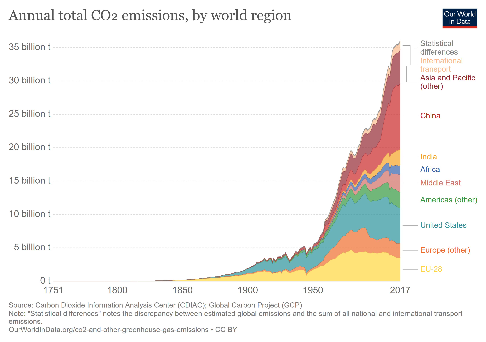

### Purpose

I saw a chart of CO2 Emissions over time on ourworldindata.org (see chart below) and was wondering how closely that is correlated to the change in CO2 concentration in the atmosphere.  So I pulled together some data to take a look at that.  I found a fairly strong correlation (r=0.74) for data from 1960 to 2017.

### Files
*  -- the notebook I created that loads and analyses CO2 Emissions vs Atmospheric Concentration
*  -- downloaded data from ourworldindata.org.

Data Sources:

**_CO2 Emissions:_** Hannah Ritchie and Max Roser (2019) - "CO₂ and Greenhouse Gas Emissions". Published online at OurWorldInData.org. Retrieved from: 'https://ourworldindata.org/co2-and-other-greenhouse-gas-emissions' [Online Resource]

**_CO2 Concentrations:_** Dr. Pieter Tans, NOAA/ESRL (www.esrl.noaa.gov/gmd/ccgg/trends/) and Dr. Ralph Keeling, Scripps Institution of Oceanography (scrippsco2.ucsd.edu/); Data downloaded from:  ftp://aftp.cmdl.noaa.gov/products/trends/co2/co2_mm_mlo.txt
